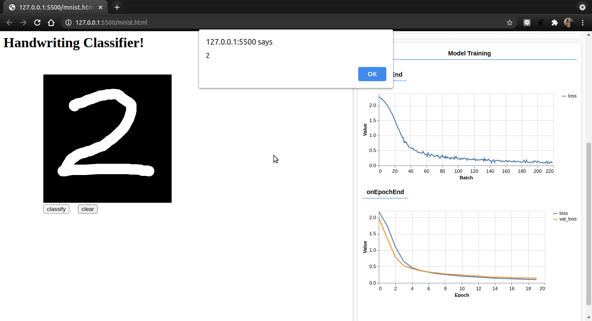

# MNIST with Tensorflow.js

Kode ini merupakan tugas Coursera pada course [Browser-based Models with TensorFlow.js](https://www.coursera.org/learn/browser-based-models-tensorflow/home/welcome).

## HOW TO

- **Sebaiknya fork dulu projek ini**

- Kemudian download projek dengan cara clone / download zip

- Buka folder projek di komputer lokal

- Jalankan dengan [live server](https://marketplace.visualstudio.com/items?itemName=ritwickdey.LiveServer) pada vs code atau [Web Server for Chrome](https://chrome.google.com/webstore/detail/web-server-for-chrome/ofhbbkphhbklhfoeikjpcbhemlocgigb)

- Tunggu pelatihan hingga selesai. (20 epoch)

- Tuliskan angka di kotak hitam dan klik `classify` untuk prediksi angka

